<div align="center">



# 📊 accordanalyst.com
### Portfolio · Resume · Case Studies · Data Visualization · Licensed Products

*The portfolio website of Alexis "Zaira" Kelly — Business Intelligence Analyst*


</div>

---

## 🗂️ What's in this repo

This repository powers **[accordanalyst.com](https://www.accordanalyst.com/)** — a portfolio site, a standalone resume page, a project catalog spanning three visual identities, and several standalone D3.js products. No frameworks, no build step — hand-built HTML/CSS/JS, deployed straight through GitHub Pages.

```
portfolio/
├── index.html                     ← Home / Portfolio (Ledger Noir — canonical)
├── resume.html                    ← Full résumé (Skills, Experience, Education, Volunteer)
├── projects.html                  ← Full project catalog — long-scroll version
├── projects-v1-tabs.html          ← Catalog redesign: tab-filtered, compact grid
├── projects-v2-accordion.html     ← Catalog redesign: collapsible sections
├── projects-v3-search.html        ← Catalog redesign: live search + URL state
├── accordanalyst-banner.svg       ← Animated boot-sequence README banner
├── privacy-policy.html            ← Legal (store.accordanalyst.com)
├── terms-of-service.html          ← Legal (store.accordanalyst.com)
├── CNAME
├── robots.txt
├── ai-blocker.js                   ← Site defense script (see Foxglove 🦊)
├── update-blocklist.py
│
└── projects/
    ├── intl-freight-audit.html            ← Case study: Excel audit automation
    ├── revenue-reconciliation.html        ← Case study: SQL query set
    ├── revenue-anomaly-detector.html      ← Case study: Python anomaly detection
    ├── freight-audit-dashboard.html       ← Case study: Excel + D3 dashboard
    ├── revenue-leak-sankey.html           ← Midnight Curtain: Sankey diagram
    ├── carrier-exposure-network.html      ← Midnight Curtain: heatmap + force graph
    ├── live-invoice-triage.html           ← Midnight Curtain: animated data join
    ├── dragrace-showcase.html             ← Licensed product preview (glam identity)
    ├── finance-showcase.html              ← Reskin demo of the drag race template
    ├── fuel-showcase.html                 ← Licensed product preview (professional identity)
    ├── thumb/                              ⚠️ note: singular "thumb", not "thumbs"
    │   └── (SVG thumbnails for the four free case studies)
    └── showcase/                           ← images/SVGs for the three licensed-product carousels
        ├── dragrace_queens_age.svg
        ├── dragrace_outcome.svg
        ├── dragrace_lipsync.svg
        ├── dragrace_hall_of_fame.png        (no chart to extract — HTML table)
        ├── fuel_trend.svg
        ├── fuel_volatility.svg
        ├── fuel_regional.png                (no chart to extract — HTML list)
        ├── finance_deal_volume.png
        ├── finance_revenue_mix.png
        └── finance_top_products.png
```

---

## 🍷 Design system — Ledger Noir

The core site runs on a single visual identity: **Ledger Noir** — near-black and ivory, with a single garnet/wine accent standing in for every highlight, link, and rule on the page. Slab-serif headings (Zilla Slab), clean body text (Inter), monospace for dates and labels (IBM Plex Mono).

| Token | Role | Light mode | Dark mode |
|---|---|---|---|
| `--bg` / `--surface` | Page & card background | `#F7F3EE` ivory | `#0D0908` near-black |
| `--heading` / `--nav-bg` | Headings, nav bar | `#14100E` | `#0A0706` |
| `--accent` | Links, highlights, rules | `#7A1F2E` garnet | `#B33A4C` |
| `--accent2` | Secondary depth accent | `#3D1015` deep wine | `#7A1F2E` |

`index.html` and `resume.html` are the canonical, promoted versions of this theme — no `-v1` suffix, no other theme variants live in production.

### Two additional identities live only inside `/projects/`

- **Midnight Curtain** (navy/royal blue/periwinkle) — used exclusively for the three pure-D3 visualization pieces. A deliberately different, cooler palette from Ledger Noir, chosen to visually separate "portfolio content" from "technique demonstration."
- **Velvet Exchange** (blue + periwinkle + purple + crimson) — used only on the finance reskin demo, to prove the drag race template can carry an entirely different color identity without any code changes.

---

## 🎨 Palette credit

<div align="center">

         

</div>

The site's entire color direction traces back to a still from **David Lynch's *Blue Velvet* (1986)** — sourced from the Instagram account **[@colorpalette.cinema](https://www.instagram.com/colorpalette.cinema/)**. Ledger Noir distills that palette to its shadow-and-wine notes; Midnight Curtain and Velvet Exchange pull from the blue/purple/crimson side of the same still instead. Full credit to Color Palette Cinema for the original extraction.

---

## 🧭 Live Search + URL State

`projects.html` grew to 10 entries across three categories and turned into an annoying long-scroll page — so there is only one new and improved version to utilize.

| File | Pattern | What it demonstrates |
|---|---|---|
| `projects-v3-search.html` | Live search + URL state | The most involved of the three — a small state-object + render-function architecture, real-time text search, category pills that combine with search, and the URL hash updates as you filter, so any filtered view is a shareable link |

---

## 🎬 Licensed Products

Three of the catalog entries are **preview walkthroughs, not live tools** — active products still available for licensing:

- **The Main Stage** — a glam-styled Drag Race stats dashboard (14 seasons, entertainment data)
- **U.S. Diesel Price Intelligence Dashboard** — a professional fuel-surcharge tool for freight/transportation teams
- **Quarterly Revenue Intelligence** — a finance-sector reskin of The Main Stage's own template, proving the underlying dashboard code is genuinely reusable, not a one-off

Each shows an auto-advancing screenshot carousel (some frames are extracted live SVG chart markup, not raster images, for genuine infinite-resolution crispness) instead of the working dashboard, since giving away a fully functional copy would undercut the actual product.

---

## 🧵 Recent changes

- 🎨 Added **Midnight Curtain**, a blue-forward visual identity used exclusively for three new pure-D3.js visualization pieces: a **Sankey diagram** (revenue leak flow), a **heatmap + force-directed network graph** (carrier exposure, replacing an earlier treemap), and a **live animated data-join demo** (D3 enter/update/exit made visible).
- 🍷 Promoted **Ledger Noir to canonical** — `index.html` and `resume.html` are now the real, permanent files (no more `-v1` suffix or parallel theme variants in production).
- 🎬 Added three **Licensed Product** showcases (Drag Race, Fuel Intelligence, and a Finance reskin demo of the Drag Race template) — screenshot/SVG carousels only, protecting the actual sellable products.
- 🧭 Rebuilt `projects.html` into **the live search + URL state** to solve growth of the catalog as it passed 10 entries.
- 🎞️ Added an animated SVG banner (boot-sequence style: fade-in → type-in → progress bar → "system ready") for the top of this README.
- 🐛 Fixed a recurring **dark-mode contrast bug** (card headers pulling background from a text-color token that flips light in dark mode) across the homepage, project catalog, and all case studies.
- 🐛 Fixed a **thumbnail aspect-ratio bug** causing side-cropping on Featured Project cards.
- 🐛 Fixed a **heatmap clipping bug** (rotated axis labels swinging outside the SVG viewBox) and substantially reworked its visual design — three-stop color scale, adaptive text contrast per cell, a spotlight on the highest-value cell.
- ✍️ Updated hero copy, marquee text, and title to **"Business Intelligence Analyst"**.

---

## ⚠️ Known gotchas (read before you redeploy)

- **Folder name is `thumb`, singular**, and the licensed-product screenshots live in `projects/showcase/` — mismatch either and images will 404 silently.
- **GitHub Pages → Settings → Actions → General → Workflow permissions** must be **"Read and write permissions."** Read-only here makes `build` succeed while `deploy` fails silently — the live site looks unchanged even after a clean-looking push.
- **DNS is on Porkbun**, not Cloudflare. A wildcard (`*.accordanalyst.com`) forwarding rule already handles `www` — any new subdomain needs its own explicit DNS record to take priority over it.
- **D3 loads from a CDN** (`cdnjs.cloudflare.com`) on every D3-based page. Fine for real visitors; if you ever test these files in a sandboxed/offline environment, D3 won't load and every chart will silently render empty.
- Three showcase pages (`dragrace-`, `fuel-`, `finance-showcase.html`) mix **SVG and PNG** images depending on whether a real chart existed to extract vector markup from — HTML tables/lists (like "Hall of Fame" or "Regional Snapshot") only ever have PNG versions.

---

## 🧰 Tech stack

`HTML5` · `CSS3 (custom properties, no framework)` · `Vanilla JavaScript` · `D3.js` (Revenue Anomaly Detector, Recovery Dashboard, Sankey, Carrier Exposure, Live Invoice Triage) · `d3-sankey` · `d3.forceSimulation` · Google Fonts

---

## 📬 Contact

**Alexis "Zaira" Kelly**
[contact@accordanalyst.com](mailto:contact@accordanalyst.com) · [LinkedIn](https://linkedin.com/in/accordanalyst) · [accordanalyst.com](https://www.accordanalyst.com/)

<div align="center">

*Open to Data Analyst, Business Intelligence Analyst, and Data & Insights Analyst roles · Remote-friendly, async-first*

</div>
